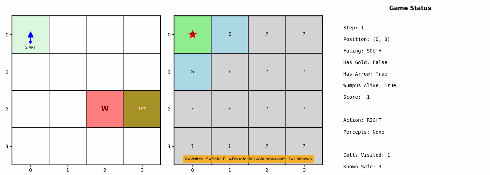

# Wumpus World - Logical Agent

A Python implementation of a logical agent for the classic Wumpus World problem, developed as part of an Intelligent Systems course.

<p align="center">
  
</p>

## Overview

The Wumpus World is a classic AI problem where an agent must navigate a cave to find gold while avoiding deadly pits and a dangerous Wumpus creature. The agent can only perceive its immediate surroundings through limited sensory information (breeze near pits, stench near the Wumpus, glitter on gold).

This implementation features a **logical agent** that uses knowledge-based reasoning to safely explore the world and retrieve the gold.

## Intelligent Mechanisms

The agent implements several AI techniques:

### 1. Knowledge Base
- Tracks visited cells, safe cells, pit-safe cells, and wumpus-safe cells
- A cell is marked "safe" only if it's safe from **both** pits and the Wumpus

### 2. Logical Inference
- No breeze at current cell → all adjacent cells are pit-safe
- No stench at current cell → all adjacent cells are wumpus-safe
- Combines evidence to deduce fully safe cells

### 3. BFS Pathfinding
- Plans optimal routes through known safe cells
- Considers agent orientation (turning costs steps)

### 4. Manhattan Distance Heuristic
- Prioritizes exploring the nearest safe unvisited cells
- Reduces unnecessary movement

### 5. Safe Exploration Strategy
- Systematically explores all reachable safe cells
- Returns home when no safe exploration is possible

### 6. Wumpus Elimination
- When stuck, attempts to shoot the Wumpus from a stench location
- On Wumpus death, all pit-safe cells become fully safe (opening new areas)

## Project Structure

```
.
├── solution.py              # Logical agent implementation
├── environment.py           # Wumpus World environment
├── wumpus.py                # Enums (Orientation, Actions, Percepts)
├── wumpus_visualizer.py     # Matplotlib visualization module
├── wumpus_visualization.ipynb  # Interactive demo notebook
└── wumpus_sim.gif           # Example simulation animation
```

## Requirements

- Python 3.7+
- matplotlib
- numpy (optional, for experiments)
- Jupyter Notebook (for interactive demo)

Install dependencies:
```bash
pip install matplotlib numpy jupyter
```

## Usage

### Running the Agent

```python
from solution import Agent
from environment import WumpusWorld

# Create world and agent
world = WumpusWorld(seed=42)
agent = Agent()

# Run episode
agent.new_episode()
percept = world.get_percept()
reward = 0

while not world.exited and world.agent_alive:
    action = agent.get_action(percept, reward)
    percept, reward, done, info = world.step(action)

print(f"Final score: {world.score}")
```

### Interactive Visualization

Open the Jupyter notebook for an interactive visualization:

```bash
jupyter notebook wumpus_visualization.ipynb
```

The notebook provides:
- Step-by-step simulation with world state display
- Agent's knowledge base visualization
- Animated simulations
- Multiple experiment runs with statistics

## Coordinate System

The environment uses screen coordinates:
- `(0, 0)` is the top-left corner (agent's starting position)
- `x` increases to the right (EAST)
- `y` increases downward (SOUTH)
- Agent starts facing EAST

## Percepts

| Percept | Meaning |
|---------|---------|
| Breeze  | Adjacent cell contains a pit |
| Stench  | Adjacent cell contains the Wumpus |
| Glitter | Gold is in the current cell |
| Bump    | Agent walked into a wall |
| Scream  | Wumpus was killed by the arrow |

## Actions

| Action  | Effect |
|---------|--------|
| FORWARD | Move one cell in facing direction |
| LEFT    | Turn 90 degrees counter-clockwise |
| RIGHT   | Turn 90 degrees clockwise |
| GRAB    | Pick up gold (if present) |
| SHOOT   | Fire arrow in facing direction |
| CLIMB   | Exit the cave (only at start cell) |

## Scoring

- +1000 for climbing out with gold
- -1000 for death (pit or Wumpus)
- -1 for each action
- -10 for shooting the arrow

## License

This project was developed for educational purposes as part of an Intelligent Systems course.
